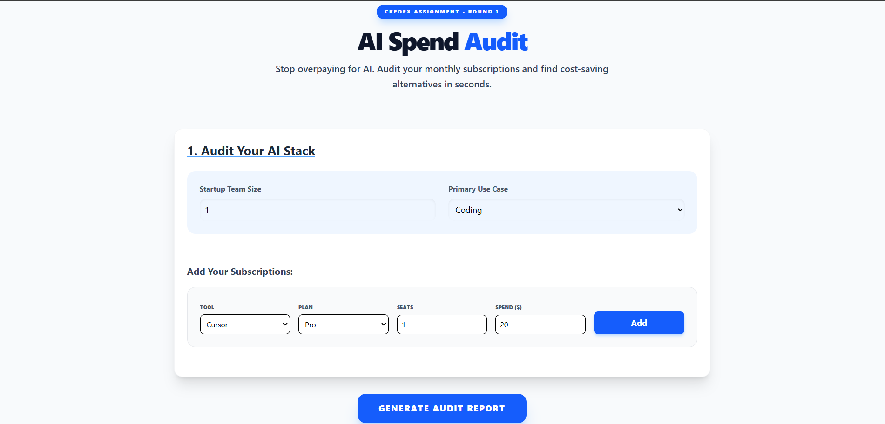
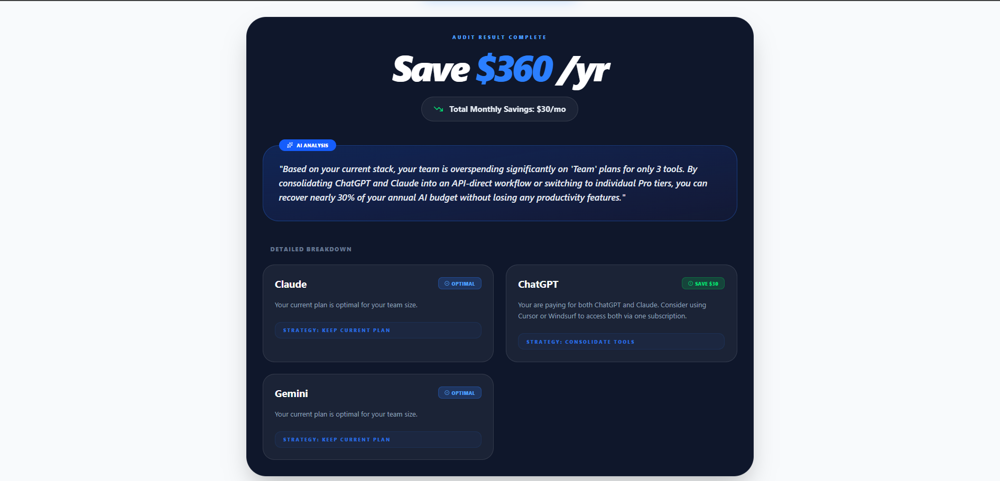

# AI Spend Audit Tool

## Project Summary
This is a professional web application built for startup founders and engineering managers to audit their monthly AI tool expenditures. It identifies overspend across popular tools like Cursor, Claude, and ChatGPT, providing defensible financial recommendations to optimize their AI infrastructure costs.

## Links & Media
- **Live Deployed URL:** https://ai-spend-audit-ecru-xi.vercel.app/
- **Demo Video:**

### 📸 Visual Walkthrough

#### 1. Main Dashboard


#### 2. Audit Analysis & Results


#### 3. Mobile Responsive View


##  Quick Start

1. **Install Dependencies:**
   ```bash
   npm install
2. **Run Locally:**
   ```Bash
   npm run dev
3. **Deploy:**
    ```Bash
  npm run build


### "Decisions" — 5 Key Trade-offs
1. **TypeScript over Plain JavaScript:** I chose TypeScript to ensure type safety for the AuditEngine logic. Dealing with financial math required strict types for tool entries and savings results to prevent runtime bugs.

2. **Tailwind CSS over Component Libraries:** I avoided heavy libraries like MUI/Bootstrap to keep the Lighthouse Performance score >90. Tailwind allowed me to build a custom, high-impact dark-themed dashboard with minimal bundle size.

3. **LocalStorage over Mandatory Login:** To reduce user friction (as per the "Cold Visitor" scenario), I implemented LocalStorage for persistence instead of a login system. This provides immediate value while still allowing for lead capture via email.

4. **Hardcoded Rules for Audit Math:** I decided against using AI for the audit math itself. Financial reasoning must be 100% accurate and "defensible." Using hardcoded logic ensures consistency, while AI is used only for the qualitative "Personalized Summary."

5. **JSONB Data Structure in Supabase:** I chose JSONB to store audit_data because it allows for a flexible tool list. Startups have diverse stacks, and a rigid SQL table would have made scaling the tool support difficult.

## 🛠️ Tech Stack
- Frontend: React.js with TypeScript
- Build Tool: Vite
- Styling: Tailwind CSS
- State Management: React Hooks with LocalStorage persistence